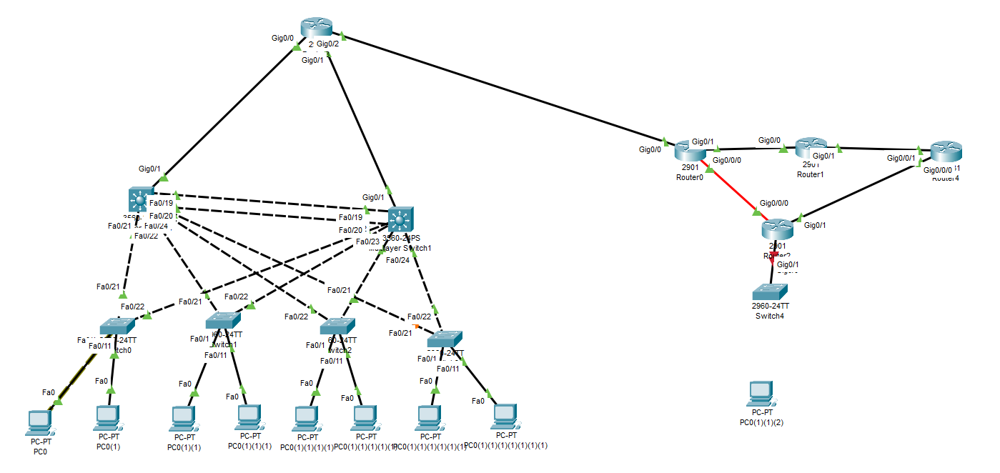

# Lab CCNA
Lab Cisco CCNA  2-tier layer design  with different network features 

## simulator
Packet tracer cisco 
## Equipement
- Switch layer 2
- Switch layer 3
- Router
- copper straight through cable
- copper cross over cable
## routing
- Ospf.
- Static.

## features
- Etherchannel.
- HSRP.
- STP.
- Vlan.

## Description
In this lab we have two layer the  the access layer and  distribution layer, The access layer the switchs connect directly with devices ,In the distribution layer we have switch layer 3  is more powerful than the access layer's switch to forward the traffic to the router. 
